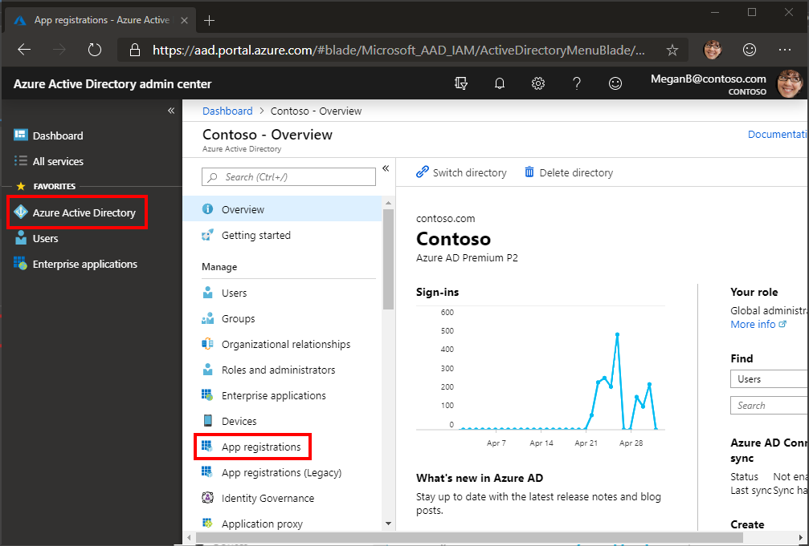
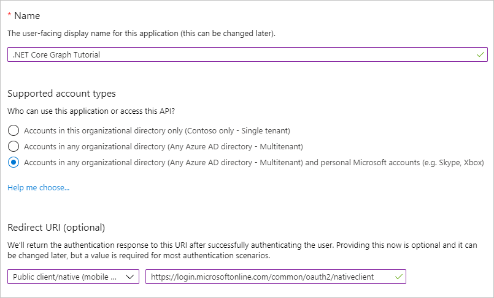

<!-- markdownlint-disable MD002 MD041 -->

在本练习中，将使用 Azure Active Directory 管理中心创建新的 Azure AD 应用程序。

1. 打开浏览器，并转到 [Azure Active Directory 管理中心](https://aad.portal.azure.com)。然后，使用**个人帐户**（亦称为“Microsoft 帐户”）或**工作或学校帐户**登录。

1. 选择左侧导航栏中的“**Azure Active Directory**”，再选择“**管理**”下的“**应用注册**”。

    

1. 选择“新注册”****。 在“注册应用”**** 页上，按如下方式设置值。

    - 将“名称”**** 设置为“`.NET Core Graph Tutorial`”。
    - 将“受支持的帐户类型”**** 设置为“任何组织目录中的帐户和个人 Microsoft 帐户”****。
    - 在 "**重定向 URI**" 下，将下拉列表更改为 "**公用客户端（移动 & 桌面）**"，并将值设置为`https://login.microsoftonline.com/common/oauth2/nativeclient`。

    

1. 选择 "**注册**"。 在 " **.Net Core Graph 教程**" 页上，复制**应用程序（客户端） ID**的值并保存它，下一步将需要它。

    

1. 选择“管理”**** 下的“身份验证”****。 找到 "**高级设置**" 部分，将 "将**应用程序视为公用客户端**" 切换为 **"是"**，然后选择 "**保存**"。

    
